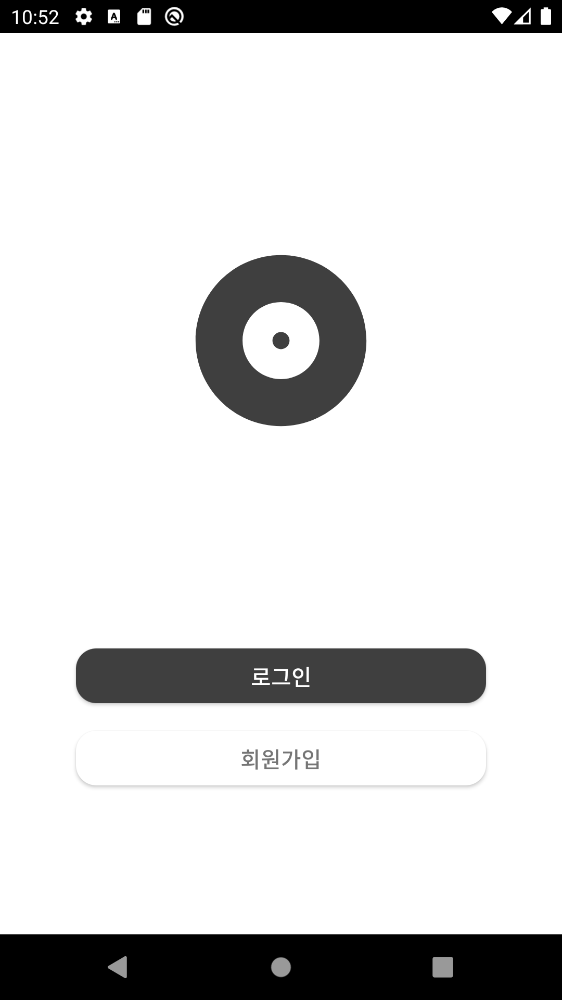
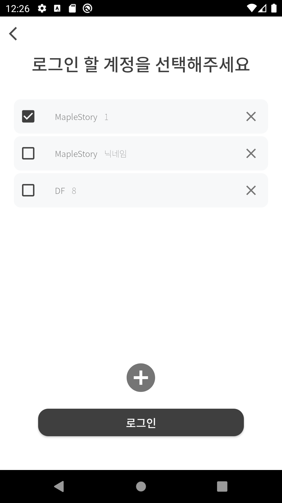
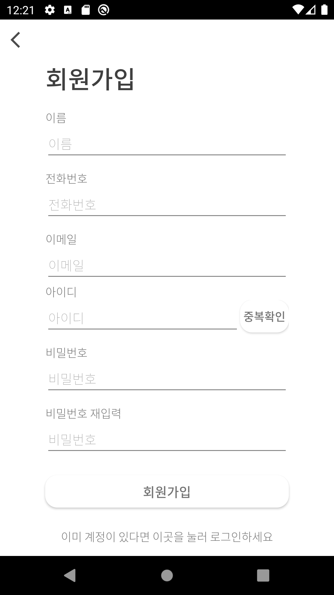
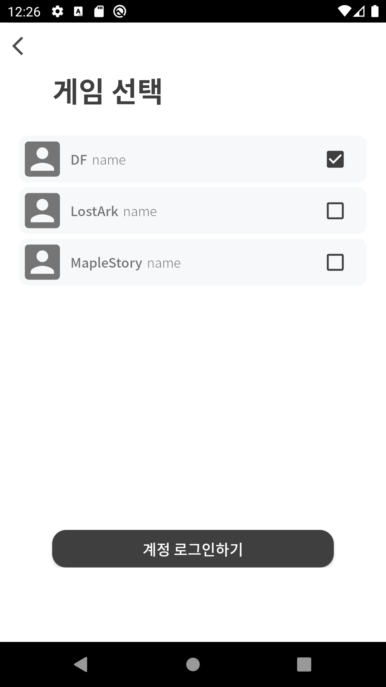
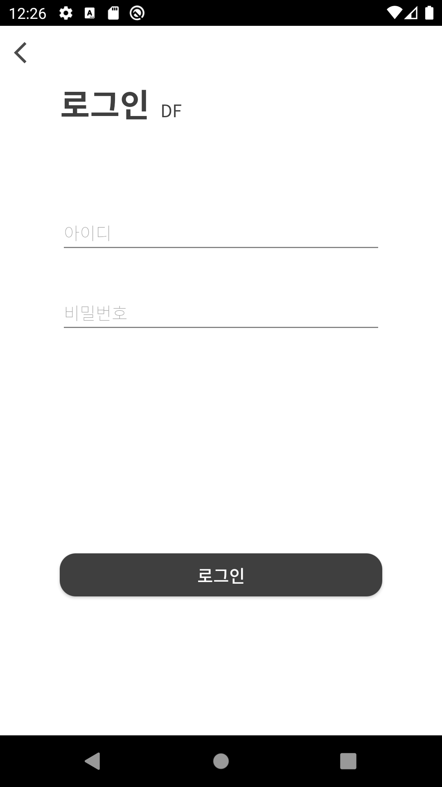
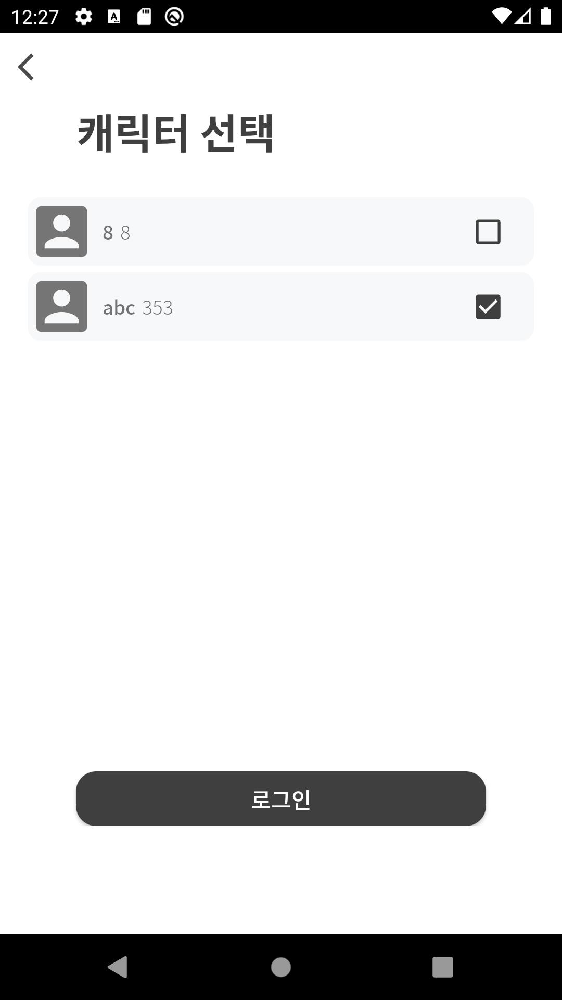
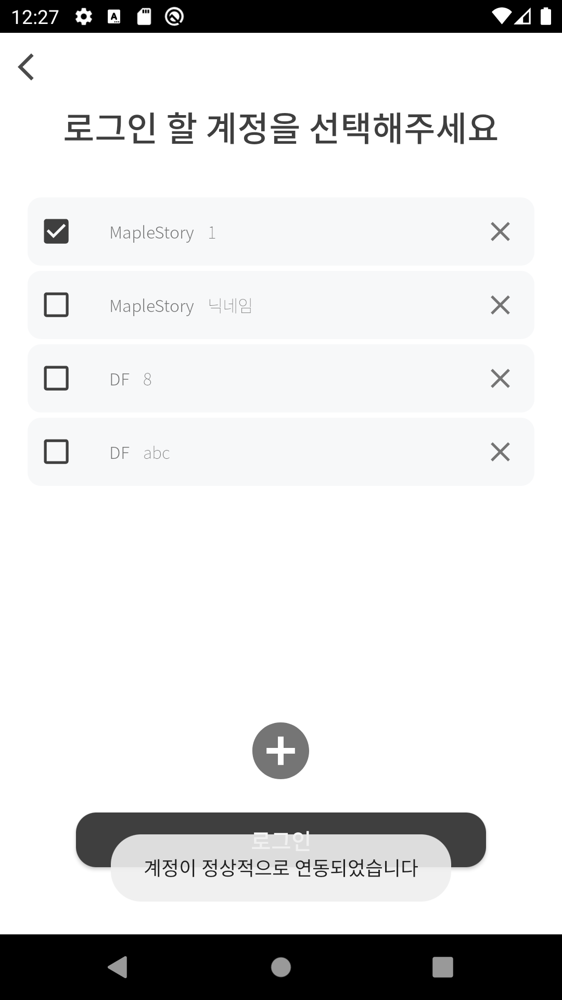

# 경매장 앱
## 목차
1. 설계 기획 및 계획서
2. [구현](#2.-구현)
3. [테스트](#3.-테스트)
4. [WIKI](#4.-WIKI)

### 1. 설계 기획 및 계획서
### 2. 구현
#### 초기화면 및 메인화면
|초기화면|메인화면|
|:---:|:---:|
|||

#### 로그인과 회원가입 화면

|로그인|회원가입|
|:---:|:---:|
|||

#### 계정 연동(+ 버튼) 과정
|게임 선택화면|계정 로그인화면|캐릭터 선택화면|연동 후 메인화면|
|:---:|:---:|:---:|:---:|
|||||

### 3. 테스트
|클래스 이름|실행결과|
|:---:|:---:|
|[GameAccountInfoTest](./app/src/test/java/com/example/teamauction/GameAccountInfoTest.java)|[.pdf](./design/test/GameAccountInfoTest.pdf)|

### [4. WIKI](https://github.com/ponopono0322/TeamAuction/wiki)