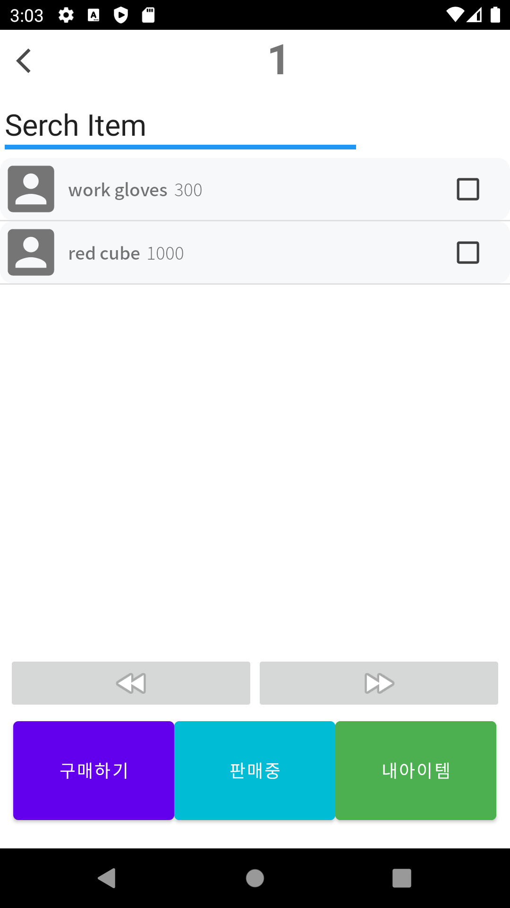
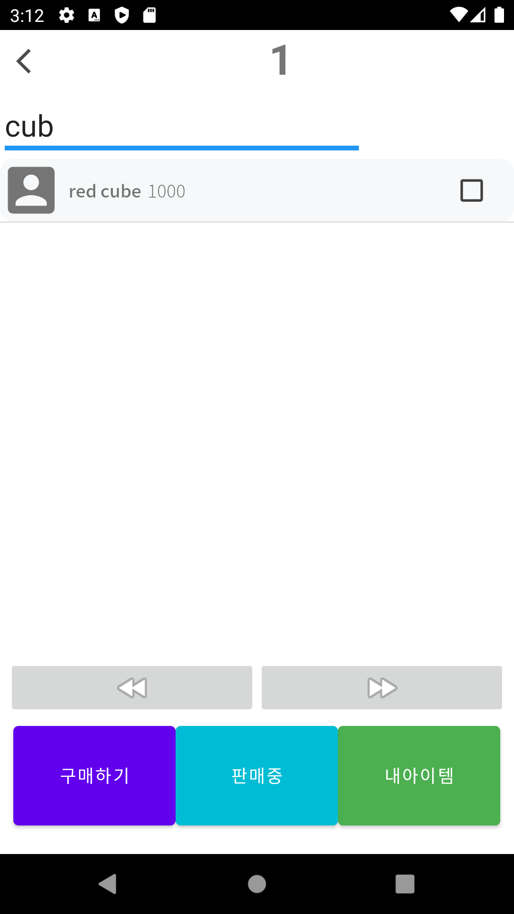
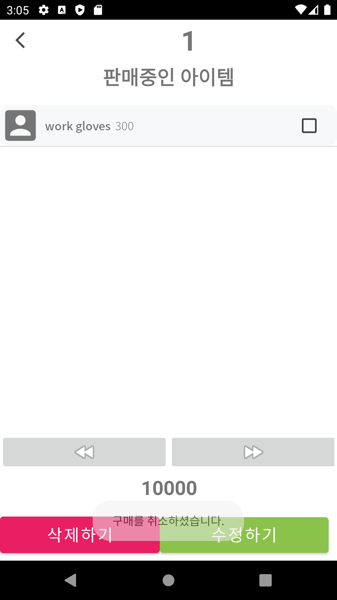
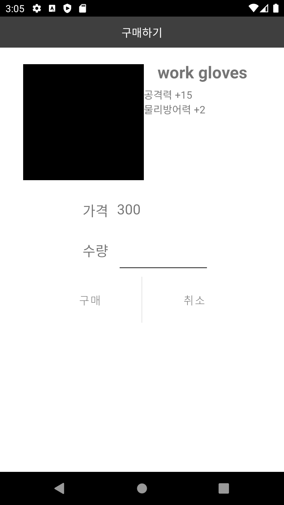

# Contents
- [Contents](#contents)
  - [1. Plan](#1-plan)
      - [개발 계획서](#개발-계획서)
      - [개발 분석](#개발-분석)
      - [개발 설계](#개발-설계)
      - [업데이트 기록](#업데이트-기록)
      - [브랜치 기록](#브랜치-기록)
  - [2. Implement](#2-implement)
    - [구성 화면(계정 관련)](#구성-화면계정-관련)
    - [구성 화면(계정 연동 관련)](#구성-화면계정-연동-관련)
    - [구성 화면(경매장 로딩과 필터링)](#구성-화면경매장-로딩과-필터링)
  - [3. Test](#3-test)
  - [4. Algorithm](#4-algorithm)
  - [5. Document](#5-document)
      - [Java 파일 목록](#java-파일-목록)
      - [Xml 파일 목록](#xml-파일-목록)
      - [Php 파일 목록](#php-파일-목록)
      - [Class 정의 목록](#class-정의-목록)
      - [Function 정의 목록](#function-정의-목록)
      - [Php 정의 목록](#php-정의-목록)

## 1. [Plan](https://github.com/ponopono0322/TeamAuction/wiki/Plan)
#### [개발 계획서](https://github.com/ponopono0322/TeamAuction/wiki/Plan#개발-계획서)
#### [개발 분석](https://github.com/ponopono0322/TeamAuction/wiki/Plan#분석)
#### [개발 설계](https://github.com/ponopono0322/TeamAuction/wiki/Plan#설계)
#### [업데이트 기록](https://github.com/ponopono0322/TeamAuction/pulls?q=is%3Apr+is%3Aclosed)
#### [브랜치 기록](https://github.com/ponopono0322/TeamAuction/network)

## 2. [Implement](https://github.com/ponopono0322/TeamAuction/wiki/Plan#구현)
*각 표 제목을 클릭하면 관련 문서(Wiki)로 이동합니다*
### 구성 화면(계정 관련)

|[초기화면](https://github.com/ponopono0322/TeamAuction/wiki/Project-Files#1-mainstartactivity)|[로그인](https://github.com/ponopono0322/TeamAuction/wiki/Project-Files#2-mainloginactivity)|[회원가입](https://github.com/ponopono0322/TeamAuction/wiki/Project-Files#3-mainsignupactivity)|[메인화면](https://github.com/ponopono0322/TeamAuction/wiki/Project-Files#5-mainactivity)|
|:---:|:---:|:---:|:---:|
|||||

### 구성 화면(계정 연동 관련)

|[게임 선택화면](https://github.com/ponopono0322/TeamAuction/wiki/Project-Files#6-gamelistactivity)|[계정 로그인화면](https://github.com/ponopono0322/TeamAuction/wiki/Project-Files#7-gameloginactivity)|[캐릭터 선택화면](https://github.com/ponopono0322/TeamAuction/wiki/Project-Files#8-gamechactivity)|[연동 후 메인화면](https://github.com/ponopono0322/TeamAuction/wiki/Project-Files#5-mainactivity)|
|:---:|:---:|:---:|:---:|
|||||

### 구성 화면(경매장 로딩과 필터링)

|[경매장 화면](https://github.com/ponopono0322/TeamAuction/wiki/Project-Files#16-auctionscreen)|[아이템 검색](https://github.com/ponopono0322/TeamAuction/wiki/Project-Files#16-auctionscreen)|[내 경매목록](https://github.com/ponopono0322/TeamAuction/wiki/Project-Files#20-sellingitemscreen)|[아이템 구입](https://github.com/ponopono0322/TeamAuction/wiki/Project-Files#17-buyingscreen)|
|:---:|:---:|:---:|:---:|
|||||

## 3. [Test](https://github.com/ponopono0322/TeamAuction/wiki/TestCase)
- *테스트 파일 위치는 [이곳](./app/src/androidTest/java/com/example/teamauction)과 [이곳](./app/src/test/java/com/example/teamauction)에서 확인할 수 있습니다*
- *클래스 이름을 누르면 해당 테스트의 정의로 넘어갑니다*

|클래스 이름|실행결과|클래스 이름|실행결과|
|:------:|:----:|:------:|:----:|
|[MainStartActivityTest](https://github.com/ponopono0322/TeamAuction/wiki/TestCase#mainstartactivitytest)|[.pdf](./design/test/MainStartActivityTest.pdf) [.html](./design/test/MainStartActivityTest.html)|[GameAccountInfoTest](https://github.com/ponopono0322/TeamAuction/wiki/TestCase#gameaccountinfotest)|[.pdf](./design/test/GameAccountInfoTest.pdf) [.html](./design/test/GameAccountInfoTest.html)|
|[MainLoginActivityTest](https://github.com/ponopono0322/TeamAuction/wiki/TestCase#mainloginactivitytest)|[.pdf](./design/test/MainLoginActivityTest.pdf) [.html](./design/test/MainLoginActivityTest.html)|[ListViewItemTest](https://github.com/ponopono0322/TeamAuction/wiki/TestCase#listviewitemtest)|[.pdf](./design/test/ListViewItemTest.pdf) [.html](./design/test/ListViewItemTest.html)|||
|[MainSignupActivityTest](https://github.com/ponopono0322/TeamAuction/wiki/TestCase#mainsignupactivitytest)|[.pdf](./design/test/MainSignupActivityTest.pdf) [.html](./design/test/MainSignupActivityTest.html)|||
|[MainPasswordActivityTest](https://github.com/ponopono0322/TeamAuction/wiki/TestCase#mainpasswordactivitytest)|[.pdf](./design/test/MainPasswordActivityTest.pdf) [.html](./design/test/MainPasswordActivityTest.html)|||
|[MainActivityTest](https://github.com/ponopono0322/TeamAuction/wiki/TestCase#mainactivitytest)|[.pdf](./design/test/MainActivityTest.pdf) [.html](./design/test/MainActivityTest.html)|||
|[GameListActivityTest](https://github.com/ponopono0322/TeamAuction/wiki/TestCase#gamelistactivitytest)|[.pdf](./design/test/GameListActivityTest.pdf) [.html](./design/test/GameListActivityTest.html)|||
|[GameLoginActivityTest](https://github.com/ponopono0322/TeamAuction/wiki/TestCase#gameloginactivitytest)|[.pdf](./design/test/GameLoginActivityTest.pdf) [.html](./design/test/GameLoginActivityTest.html)|||
|[GameChActivityTest](https://github.com/ponopono0322/TeamAuction/wiki/TestCase#gamechactivitytest)|[.pdf](./design/test/GameChActivityTest.pdf) [.html](./design/test/GameChActivityTest.html)|||

## 4. [Algorithm](https://github.com/ponopono0322/TeamAuction/wiki/Plan#project-algorithm)

*위의 링크를 클릭하면 해당 페이지로 이동합니다*

## 5. [Document](https://github.com/ponopono0322/TeamAuction/wiki)
#### [Java 파일 목록](https://github.com/ponopono0322/TeamAuction/wiki/Project-Files#Java-Files)
#### [Xml 파일 목록](https://github.com/ponopono0322/TeamAuction/wiki/Project-Files#Xml-Files)
#### [Php 파일 목록](https://github.com/ponopono0322/TeamAuction/wiki/Project-Files#Php-Files)
#### [Class 정의 목록](https://github.com/ponopono0322/TeamAuction/wiki/Docs#Class)
#### [Function 정의 목록](https://github.com/ponopono0322/TeamAuction/wiki/Docs#Function)
#### [Php 정의 목록](https://github.com/ponopono0322/TeamAuction/wiki/Docs#Php)
